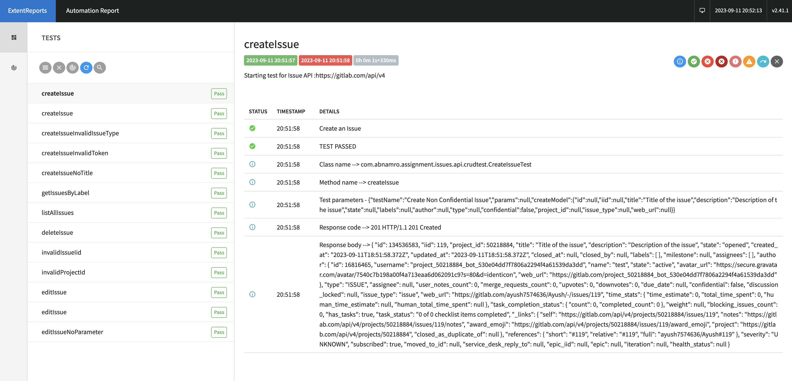

# Backend Test Automation Assignment [](https://gitpod.io/from-referrer/)

<a href="https://gitpod.io/from-referrer/" style="padding: 10px;">
    
</a>

## Requirements
### Environment
* GitHub account
* Java 11 (JDK) (optionally)
* Maven 3.6+ (optionally)
* Any IDE you comfortable with (eg. IntelliJ, VSCode)

### Skills
* Java 8+ (coding standards)
* Clean Code
* Maven
* Git, GitLab, GitHub

### Instructions
Fork this project
<details>
<summary>Example</summary>


</details>

#### Working in Web IDE (preferable)

1. Open Project in [GitPod](https://gitpod.io/from-referrer/):
2. Sing-in with GitHub account
3. Create and commit your solution into your forked repository
4. Create documentation in the README.md under the `Documentation` section
5. IMPORTANT: Enable Repository permissions (e.g. git push) for GitPod when coding from Web IDE here:
   https://gitpod.io/integrations
   <details>
   <summary>Details here</summary>

   Edit permission for GitHub:

   

   
   </details>

## Documentation

REST API Test suite to do automated testing for Gitlab Issues API - https://docs.gitlab.com/ee/api/issues.html

### Tech Stack

- [Java 11](https://www.oracle.com/nl/java/technologies/javase/jdk11-archive-downloads.html)
- [Rest Assured](https://rest-assured.io/)
- [Extent Reports](https://www.extentreports.com/docs/versions/4/java/index.html)
- [TestNg](https://testng.org/doc/)
- [Maven Surefire Plugin](https://maven.apache.org/surefire/maven-surefire-plugin/)

### Crud Cases Covered

1. Create an Issue - https://docs.gitlab.com/ee/api/issues.html#new-issue
2. Read all Issues and read with filters - https://docs.gitlab.com/ee/api/issues.html#list-project-issues
3. Update Issue - https://docs.gitlab.com/ee/api/issues.html#edit-issue
4. Delete Issue - https://docs.gitlab.com/ee/api/issues.html#delete-an-issue

### Edge Cases Covered

1. Create Issue with invalid or missing mandatory data.
2. Create Issue with invalid PAT
3. Edit issue that does not exist
4. Delete issue that does not exist

### Possible future improvements

1. Use external, readable file formats like json to provide input data in tests.

### Pre run setup

We need following properties to run our tests

1. `BASE_URI` : The URI for the GITLAB issues API. Its value is set in the `config.properties`.
2. `PERSONAL_ACCESS_TOKEN` : The personal access token used to authenticated with Gitlab API.
3. `GITLAB_PROJECT_ID` : Id of the gitlab project.


### How to run the CRUD tests

1. Clone git repository
2. Navigate to the repository folder
3. Open terminal and run the following commands in order


```
export GITLAB_PROJECT_ID=<gitlab project id>
```
```
export PERSONAL_ACCESS_TOKEN=<personal access token from gitlab project>
```
```
mvn clean test 
```

The first two commands are used to set the `project id` of the gitlab project and the `personal access token` required to access the API.

If these values are not found then the `config.properties` will be used to look for `project id` and the `access token`.

### How to view test reports

1. After the `mvn clean test` , at the root level `Report.html` file will be generated.



2. The report contains details of each test run and the data passed and received from CRUD operation.
